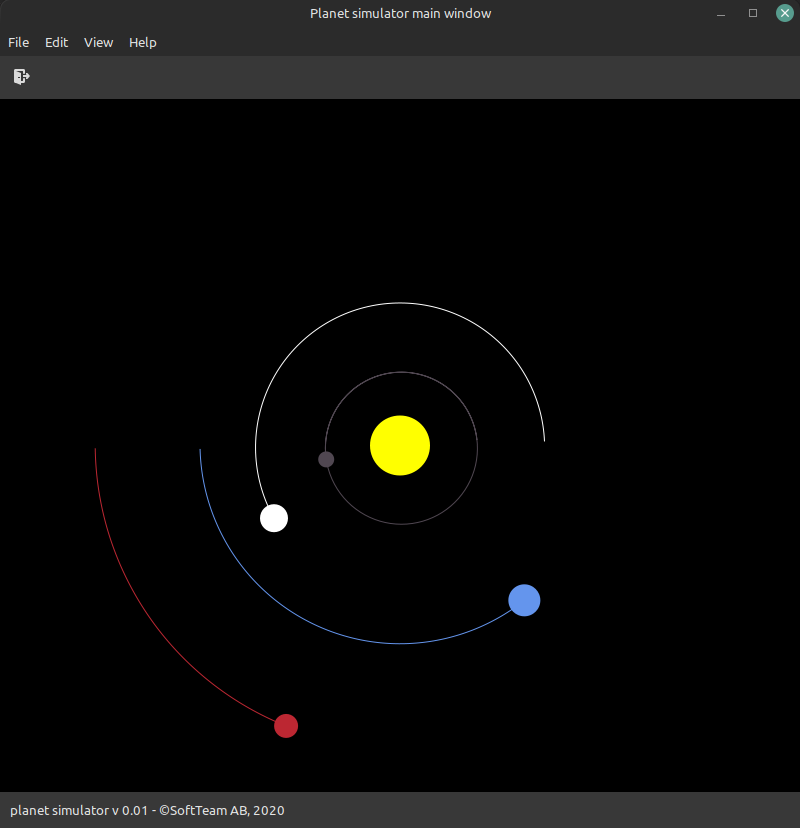

# PLANER SIMULATOR

An application that simulates planets moving around the sun in a solar system.

Written in Go, using GTK.

## LINKS

* Inspiration came from Tech With Tim's video : https://www.youtube.com/watch?v=WTLPmUHTPqo

## SCREENSHOT

(to be replaced later, with a real screenshot)

## TODO
